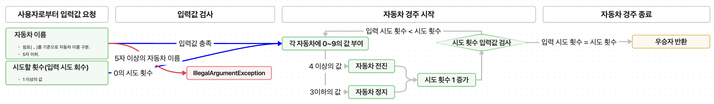

# kotlin-racingcar-precourse

## 자동차 경주 흐름도

## 기능 요구 사항
- [x] 입력값 요청 및 검사.
  - [x] 자동차(레이서) 이름 입력 요청.
    - [x] 2대 이상의 레이서 이름이 입력되었는지 검사.
    - [x] 각 레이서의 이름이 5자 이하인지 검사.
  - [x] 시도할 경주 횟수 요청.
    - [x] 숫자가 아닌 경우 예외 처리.

- [x] 자동차 경주 시작.
  - [x] 각 자동차에 0~9의 값 부여.
    - [x] 부여된 값이 4 이상 이면 자동차를 전진.
  - [x] 각 경주 시도 마다 횟수 증가.
  - [x] 지정된 시도 횟수 만큼 반복.
   
- [x] 자동차 경주 종료.
  - [x] `입력 시도 횟수 = 시도 횟수`이면, 경주 종료.
  - [x] 최종 우승자 출력.

## 추가 예외 테스트
- `레이서 이름 입력값 테스트#1`: 레이서 이름 입력값에 한글이 있는 경우.
  - 기존 코드에서 정상 작동
- `레이서 이름 입력값 테스트#2`: 레이서 이름 입력값에 공백이 있는 경우.
  - 공백 제거한 후 경주 수행되도록 함.
- 